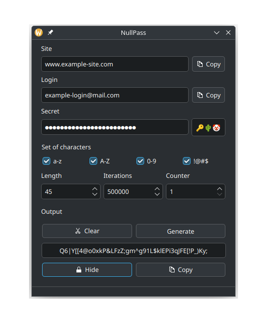

## NullPass

NullPass is a desktop application designed to simplify the way you handle your passwords. 
Unlike traditional password managers, this application operates entirely on your local machine. 
Importantly, it does not store any passwords physically on your disk. 
Instead, it generates passwords on-the-fly based on a master password and a set of user-defined parameters. 
This means that your passwords are never saved in a retrievable format, significantly reducing the risk of unauthorized access or data breaches.
As a result of this design, there is no backups and synchronization between devices. 

### User Defined Input
`Site` - The name of the website or service for which the password is being generated.

`Login` - The username or email address associated with the account on the specified site.

`Secret` - A secure password that the user creates to generate and access their passwords.

### Options
`a-z` - Include lowercase letters.

`A-Z` - Include uppercase letters.

`0-9` - Include numeric digits.

`!@#` - Include special characters.

`Length` - The desired length of the generated password. Users can specify how many characters the password should contain.

`Iterations` - The number of iterations used in the password generation process, which can enhance security by making it more difficult to reverse-engineer the generated password.

### Output
The result of the password generation process is a secure password derived using the **PBKDF2** (Password-Based Key Derivation Function 2) algorithm with **SHA-512** as the hashing function. 

### Unresolved Issues
- Clipboard History Management: 
The application currently lacks the functionality to remove copied values from the clipboard history.
- Local Database for Logins: 
There is no local database for storing website login credentials (feature / bug)

### Note
This Password Manager is inspired by **LessPass**, aiming to provide a similar level of security and functionality while operating as a desktop application. 
